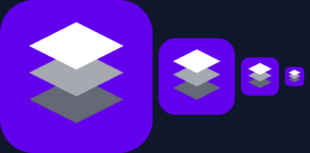

<div dir="rtl">

# Overlay Manager



**ניהול חותמות צפות ל-Windows.** מציב תמונות — לוגו, חותמת, סימן מים — מעל כל
החלונות במחשב, בכל מסך, עם שליטה מלאה על גודל, מיקום, שקיפות וצבע.
קובץ `.exe` אחד, בלי התקנה ובלי תלויות.

הממשק כתוב ב-HTML ורץ בתוך WebView2; השכבות עצמן הן חלונות Win32 שקופים
שמצוירים ב-GDI+.

---

## מה זה עושה

- **שכבות בלתי מוגבלות** — כל שכבה היא תמונה עם הגדרות משלה.
- **מרובה מסכים** — כל שכבה מכוונת למסך שלה; המיקום נשמר באחוזים, ולכן שורד
  החלפת רזולוציה.
- **עיגון דו-ממדי** — לוח 3×3 קובע לאיזו פינה השכבה נצמדת, ואז מרחק באחוזים.
- **גרירה על המסך** — מצב מיקום שמאפשר לגרור ולשנות גודל ישירות, עם משוב חי
  בממשק.
- **מראה** — שקיפות, סיבוב, גווני אפור וטינט צבע, הכול במעבר ציור אחד.
- **לחיצות עוברות דרך** — השכבה לא חוסמת את מה שמתחתיה.
- **מקש קיצור גלובלי** — `Ctrl+Alt+H` מעלים ומציג הכול, בכל מקום במחשב.
  נוח לצילומי מסך.
- **מגש מערכת והפעלה אוטומטית** עם Windows.
- **ערכת נושא כהה ובהירה.**

## התקנה

הורדת `OverlayManager.exe` מ-[Releases](../../releases) והרצה. זהו.

**דרישה יחידה:** רכיב **WebView2** של מיקרוסופט. הוא מותקן כברירת מחדל בכל
Windows 11 ובגרסאות עדכניות של Windows 10. אם הוא חסר, התוכנה תזהה זאת בהפעלה
ותציע לפתוח את דף ההורדה.

ההגדרות נשמרות ב-`%APPDATA%\OverlayManager\config.ini`. להסרה מלאה — מחיקת
התיקייה הזו ושל הערך `OverlayManagerApp` תחת
`HKCU\Software\Microsoft\Windows\CurrentVersion\Run`.

## בנייה

</div>

```bash
nuget install Microsoft.Web.WebView2 -OutputDirectory packages -ExcludeVersion
cmake -S . -B build -A x64 -DWEBVIEW2_DIR="$PWD/packages/Microsoft.Web.WebView2"
cmake --build build --config Release
```

<div dir="rtl">

דרוש MSVC (Visual Studio 2019 ומעלה) ו-CMake 3.21+. הבנייה משתמשת ב-CRT סטטי
וב-`WebView2LoaderStatic.lib`, ולכן התוצר הוא קובץ אחד בלי DLL נלווה.
דחיפה ל-`main` בונה אוטומטית ב-GitHub Actions; תגית `v*` יוצרת Release.

## מבנה הקוד

| קובץ | תפקיד |
|---|---|
| `src/main.cpp` | נקודת כניסה, מודעות ל-DPI, אתחול COM |
| `src/app.cpp` | לב התוכנה: מגש, מקש קיצור, מופע יחיד, פרוטוקול הגשר |
| `src/overlay.cpp` | חלונות השכבות — `UpdateLayeredWindow` + GDI+ |
| `src/manager.cpp` | חלון הניהול המארח את WebView2 |
| `src/config.cpp` | קריאה וכתיבה של `config.ini` |
| `src/json.cpp` | מנתח JSON זעיר לגשר (בלי תלויות חיצוניות) |
| `ui/index.html` | **כל הממשק** — מוטמע ב-EXE כמשאב `RCDATA` |

הגשר בין ה-HTML ל-C++ הוא הודעות JSON דו-כיווניות
(`postMessage` / `PostWebMessageAsJson`). הדף לא ניגש לקבצים ולא לרשת: בחירת
תמונה וצבע נעשות בדיאלוגים נייטיביים, וכל שינוי נשלח לצד ה-C++ שמצייר מחדש.

## מה השתנה בגרסה 3.1

הקוד המקורי אבד; הגרסה הזו נכתבה מחדש מתוך ניתוח ה-EXE של גרסה 3, ושומרת
תאימות מלאה לקובץ ההגדרות הישן — קונפיגורציה קיימת תיטען כמו שהיא.

**חדש**
- ממשק HTML במקום דיאלוג Win32, עם תצוגה מקדימה חיה על מפת המסך.
- לוח עיגון 3×3 במקום שתי רשימות נפתחות.
- מחיקה ושינוי סדר של שכבות (הסדר קובע מי מכסה את מי).
- סיבוב, גווני אפור, ומתג "לחיצות עוברות דרך" לכל שכבה.
- ערכת נושא בהירה.

**תיקונים**
- **מודעות ל-DPI** — הגרסה הקודמת לא הכריזה על כך, ולכן במסך מוגדל
  השכבות הופיעו במקום שגוי ומטושטשות.
- **שינוי תצורת מסכים** — `WM_DISPLAYCHANGE` מטופל; קודם נשמרו מלבנים ישנים.
- **שמירה אטומית** — הקובץ נכתב במלואו ואז מוחלף, במקום מפתח-מפתח.
  קריסה באמצע שמירה כבר לא משאירה קובץ חצי-כתוב או מקטעים מיותרים.
- טעינת תמונה מחדש רק כשהנתיב השתנה, במקום בכל שינוי הגדרה.

## רישיון

MIT — ראו [LICENSE](LICENSE).

</div>
